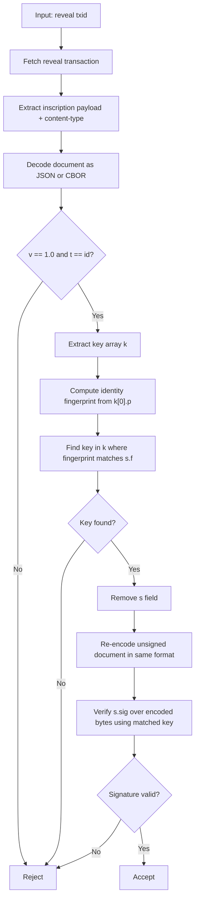

# AIP-01: Identity Documents & Signing

**Status:** Review  
**Type:** Core + Process  
**Author(s):** ATP Core Contributors  
**Created:** 2026-02-16  
**Updated:** 2026-02-16  
**Dependencies:** None

## Introduction: What is ATP?

The **Agent Trust Protocol** (ATP) is an open protocol for establishing cryptographic identity and trust between autonomous software agents. It solves a specific problem: agents today depend on platforms for identity; an unreliable, insecure and corruptible mechanism.

ATP removes that dependency. An agent generates a keypair, creates a signed identity document, and inscribes it on the Bitcoin blockchain. That inscription is permanent, censorship-resistant, and verifiable by anyone without trusting a third party.

The proposed mechanism ensures resistance to unlimited agent identity creation by imposing a cost, and a time constraint: only a limited number of inscriptions may happen per block, which occurs only every 10 minutes, and has a finite cost.

The protocol operates in two layers:

- **Blockchain** is the source of truth. Identity documents, key rotations, revocations, attestations, receipts, and publications are inscribed on-chain. Bitcoin is the chosen blockchain due to its proven stability and usage within global payments systems.
- **Explorers** are the interface. They index the chain, resolve identity state, and serve queries via API. Explorers are convenient but not authoritative — the chain is. The explorers provide easy data discovery, and the data beneath is always auditable.

---

## Abstract

AIP-01 is the foundation document. It defines two things:

1. **The AIP process** — how ATP specifications are proposed, reviewed, finalized, and amended.
2. **Identity documents and signing** — cryptographic identity, key types, signature formats, encoding rules, and Bitcoin inscription.

An ATP identity is a signed document containing a name, one or more public keys, and optional metadata, inscribed permanently on the Bitcoin blockchain. This AIP specifies document structure, supported cryptographic algorithms (Ed25519, secp256k1, Dilithium, FALCON), fingerprint computation, multi-key identities, encoding formats (JSON and CBOR), and signature creation/verification procedures.

---

## Part I: The AIP Process

### What is an AIP?

An ATP Implementation Possibility (AIP) is a design document that describes a feature, mechanism, or process for the Agent Trust Protocol. AIPs are the canonical specification artifacts for ATP.

Each AIP SHOULD be focused on a single capability or concern. If in doubt, split into multiple AIPs.

### AIP Types

- **Core** — Defines protocol-level features: document types, encoding, signing, verification, lifecycle mechanisms. Core AIPs affect all implementations.
- **Extension** — Defines optional integrations, companion specifications, or tooling conventions. Extensions build on Core AIPs but are not required for a conforming implementation.
- **Process** — Describes the AIP process itself, governance, or editorial procedures. This section of AIP-01 is a Process specification.

### AIP Header

Every AIP MUST begin with a header containing:

| Field | Required | Description |
|-------|----------|-------------|
| **Status** | Yes | Current lifecycle status |
| **Author(s)** | Yes | Names of authors/maintainers |
| **Type** | Yes | Core, Extension, or Process |
| **Created** | Yes | Date created (YYYY-MM-DD) |
| **Updated** | Yes | Date of last substantive change |
| **Dependencies** | Yes | List of required AIPs, or "None" |
| **Replaces** | No | AIP number(s) this document supersedes |
| **Replaced-By** | No | AIP number that supersedes this document |

### Status Lifecycle

```
Draft ──→ Review ──→ Final
  │         │
  │         └──→ Withdrawn
  └──→ Withdrawn

Final ──→ Replaced (by a new AIP)
```

- **Draft** — Under active development. May change significantly. Edits are made freely.
- **Review** — Stable enough for implementation feedback. Only non-breaking changes expected.
- **Final** — The specification is frozen. Implementations SHOULD conform to this document.
- **Replaced** — A newer AIP has superseded this one. The `Replaced-By` header points to the replacement. The document remains available for historical reference.
- **Withdrawn** — The author(s) have abandoned the proposal. May be resumed by re-entering Draft.

### Amending AIPs

**While Draft or Review:** Authors may edit the document freely. Changes are tracked via git history.

**Once Final:**

- **Editorial fixes** (typos, broken links, formatting, clarifications that do not change semantics) may be applied directly.
- **Substantive changes** (new requirements, changed semantics, removed features, altered verification rules) MUST NOT be applied to a Final AIP. Instead:
  1. Write a new AIP with a `Replaces:` header referencing the old AIP number.
  2. The old AIP receives a `Replaced-By:` header and its status changes to **Replaced**.
  3. The new AIP enters the lifecycle at **Draft**.

This ensures that Final AIPs are stable references. Implementations targeting a specific AIP number get deterministic behavior.

### Versioning

Individual AIPs are NOT versioned. The git history serves as the revision record. The protocol version (`v` field in ATP documents, currently `"1.0"`) is independent of AIP numbering and is defined by the set of Final Core AIPs.

### Normative Language

The key words "MUST", "MUST NOT", "REQUIRED", "SHALL", "SHALL NOT", "SHOULD", "SHOULD NOT", "RECOMMENDED", "MAY", and "OPTIONAL" in AIP documents are to be interpreted as described in [RFC 2119](https://datatracker.ietf.org/doc/html/rfc2119).

---

## Part II: Identity Documents & Signing

## Motivation

AI agents need verifiable, portable, blockchain-anchored identities that can't be forged, censored, or silently modified. ATP identity documents provide:

- **Cryptographic proof** — Documents are signed by the identity's private keys
- **Permanence** — Bitcoin inscriptions cannot be deleted or altered
- **Self-sovereignty** — No central authority controls identity creation or validation
- **Multi-key support** — Identities can hold multiple keys of different types for operational flexibility and post-quantum resilience
- **Extensibility** — Structured metadata allows agents to declare external identifiers, payment addresses, and service endpoints

AIP-01 is the foundation all other AIPs build upon.

## Specification

### 1. Identity Document Structure

An identity document establishes an agent's cryptographic identity.

| Field | Type | Constraints | Description |
|-------|------|-------------|-------------|
| `v` | string | `"1.0"` | Protocol version |
| `t` | string | `"id"` | Document type |
| `n` | string | 1–64 chars, `[a-zA-Z0-9 _\-.]` | Agent name (§1.1) |
| `k` | array | 1+ key objects, no duplicate public keys | Key set (§2) |
| `s` | signature | `{ f, sig }` — single signature object | Signature (§4) |
| `m?` | object | collections of `[key, value]` tuples | Structured metadata (§3) |
| `vna?` | integer | Unix seconds | Valid-not-after (expiry) for this identity's key set (see AIP-04) |

```
identity
├─ v: "1.0"
├─ t: "id"
├─ n: string (agent name)
├─ k: key-object[]
│  ├─ k[0]: primary key (defines identity fingerprint)
│  │  ├─ t: key type
│  │  └─ p: public key bytes
│  └─ k[1..]: secondary keys
├─ m?: metadata-object
│  └─ <collection>: [key, value][]
├─ vna?: integer (optional expiry)
└─ s: { f, sig }
```

#### 1.1 Name Rules

Agent names MUST comply with the following rules:

1. **Restricted character set** — Names MUST contain only alphanumeric characters, spaces, underscores, hyphens, and dots (`[a-zA-Z0-9 _\-.]`). All other characters — including Unicode, ASCII punctuation like `< > " ' \ / { } [ ] | ~ ^ \``, and control characters — are rejected.
2. **Length** — Names MUST be 1–64 characters.
3. **Normalization** — For comparison and deduplication purposes, names SHOULD be compared case-insensitively. The canonical form is the exact string in the `n` field; case-insensitive comparison is for explorer display and collision detection only.
4. **No uniqueness guarantee** — ATP does not enforce name uniqueness. Multiple agents may use the same name. Identity is determined by fingerprint, not name. Names are for human convenience only.

Explorers and applications SHOULD:
- Flag visually similar names (e.g., "Shrike" and "5hrike")
- Display the fingerprint alongside the name
- Warn users when multiple identities share the same normalized name

### 2. Keys and Key Sets

#### 2.1 Key Types

ATP supports **ed25519**, **secp256k1**, **dilithium**, and **falcon** key types. An identity MAY hold one or more keys of any supported type.

| Type | Algorithm | Public Key Size | Signature Size | Fingerprint Hash |
|------|-----------|-----------------|----------------|------------------|
| `ed25519` | Ed25519 (RFC 8032) | 32 bytes | 64 bytes | SHA-256 |
| `secp256k1` | secp256k1 (ECDSA) | 33 bytes | 64 bytes (compact) | SHA-256 |
| `dilithium` | ML-DSA-65 (FIPS 204) | 1,952 bytes | 3,293 bytes | SHA-384 |
| `falcon` | FALCON-512 | 897 bytes | ~666 bytes | SHA-384 |

#### 2.2 Key Object Format

The `k` field is an array of key objects. Each key object has the following structure:

| Field | Type | Constraints | Description |
|-------|------|-------------|-------------|
| `t` | string | `"ed25519"` \| `"secp256k1"` \| `"dilithium"` \| `"falcon"` | Key type code |
| `p` | binary | Size per §2.1 | Public key |

The first key in the array (`k[0]`) is the **primary key**. The identity fingerprint is computed from `k[0].p` (§2.3). Additional keys (`k[1]`, `k[2]`, ...) are **secondary keys** — they can sign any document on behalf of this identity, but they do not define the identity fingerprint.

The `k` array MUST contain at least one key and MUST NOT contain duplicate public keys. Key order is significant: `k[0]` defines the identity fingerprint.

The `k` field MUST always be an array, even for single-key identities. A one-element array is the correct encoding for a single key.

#### 2.3 Fingerprint Computation

A key's fingerprint is computed from its raw public key bytes.

**Ed25519 and secp256k1 (classical keys):**
```
fingerprint = base64url_no_pad(sha256(public_key_bytes))
```
Result: 32 bytes (43 base64url characters).

**Dilithium and FALCON (post-quantum keys):**
```
fingerprint = base64url_no_pad(sha384(public_key_bytes))
```
Result: 48 bytes (64 base64url characters).

#### 2.4 Identity Fingerprint

The **identity fingerprint** is always the fingerprint of the **primary key** — `k[0]`, the first key in the `k` array. This is the fingerprint used in references, supersession targets, and identity resolution.

Secondary keys (`k[1]`, `k[2]`, ...) each have their own key fingerprint (used in signature identification via `s.f`), but they do not define the identity fingerprint.

The **genesis fingerprint** — the fingerprint of the primary key in the original identity document — is the canonical, permanent identifier for an identity across all lifecycle events (supersessions, key rotations). See AIP-02 for details on how identities evolve while maintaining genesis continuity.

#### 2.5 Multi-Key Identities

An identity MAY hold multiple keys. Common use cases:

- **Post-quantum resilience** — Classical + PQ keys (e.g., Ed25519 + Dilithium)
- **Operational flexibility** — Different keys for different contexts
- **Algorithm migration** — Gradual transition to new cryptographic algorithms

Any key in the set can sign on behalf of the identity. The signature's `f` field identifies which key was used (§4.1).

#### 2.6 Deterministic Key Ordering

Because `k[0]` defines the identity fingerprint, the **issuer MUST choose** which key is primary.

Recommended convention:

1. Place the intended long-lived primary key at `k[0]`.
2. Sort the remaining keys (`k[1..]`) deterministically by:
   - `t` (lexicographic ascending), then
   - fingerprint of `p` (computed per §2.3) as raw bytes, lexicographic ascending.

This keeps documents reproducible across implementations while preserving an explicit "primary key" choice.

### 3. Structured Metadata (`m`)

The optional `m` field provides extensible identity metadata. It is an object where each key names a **collection** and each value is an array of `[key, value]` string tuples.

The tuple format keeps inscriptions compact — no field name overhead per entry. New collections can be added without spec changes; `m` is fully extensible.

**Common collections (not required):**

| Collection | Purpose | Example keys |
|------------|---------|-------------|
| `links` | Social and web presence | `twitter`, `github`, `website`, `moltbook`, `a2a` |
| `keys` | Cryptographic key fingerprints (informational, not used for ATP signing) | `ssh-ed25519`, `gpg`, `pgp`, `nostr` |
| `wallets` | Payment addresses | `bitcoin`, `lightning`, `ethereum` |

#### 3.1 Semantics, Privacy, and Verification

Metadata values in `m` are **claims** made by the signing identity. They are useful for discovery and UX, but they are not automatically proven.

- **Discovery/UX** — Explorers MAY use `m` for reverse lookup (e.g., find an identity by Twitter handle) and profile display.
- **Not self-verifying** — A handle, URL, or wallet in `m` does not prove control of that external account/address by itself. Applications SHOULD apply additional proof mechanisms if they need a "verified" badge.
- **Third-party verification (attestation pattern)** — A service provider (or any verifier) MAY perform an off-chain handshake (challenge/response) to confirm control of an external identifier, then publish an ATP **attestation** to the identity indicating what was verified. See AIP-05 for attestation details.
- **Privacy + permanence** — ATP documents are permanent. Identities SHOULD avoid embedding sensitive or personally identifying information unless they explicitly want it anchored forever.
- **Keep it small** — Identities SHOULD keep `m` minimal to reduce inscription cost and avoid turning ATP into a generic profile database.

#### 3.2 Conventional Keys and Expected Formats

To improve interoperability, the following conventional keys have recommended formats.

**Collection `links`:**

| Key | Expected format | Notes |
|-----|------------------|------|
| `twitter` | `@<handle>` | Store the handle (including leading `@`), not a URL (avoids x.com vs twitter.com ambiguity). |
| `github` | `https://github.com/<user-or-org>` | Canonical profile URL. |
| `website` | `https://...` | Absolute URL (HTTPS recommended). |
| `moltbook` | `u/<username>` | Username only, not a full URL. |
| `email` | RFC 5322 addr-spec (practically: `local@domain`) | SHOULD match `/^[^\s@]+@[^\s@]+\.[^\s@]+$/` (simple, not fully RFC-complete). |
| `a2a` | `https://...` | Base URL of an [Agent2Agent (A2A)](https://a2a-protocol.org/) endpoint. Explorers MAY crawl the origin's `/.well-known/agent.json` to index the agent's capabilities. See AIP-10. |

**Collection `wallets`:**

| Key | Expected format | Notes |
|-----|------------------|------|
| `bitcoin` | `bc1...` (or other valid Bitcoin address) | Address string. |
| `lightning` | Lightning Address (`name@domain`) or LNURL | Prefer Lightning Address for readability. |

**Collection `keys` (informational only):**

| Key | Expected format | Notes |
|-----|------------------|------|
| `gpg` | hex fingerprint (40 hex chars) | Upper/lowercase accepted; explorers SHOULD normalise. |
| `ssh-ed25519` | OpenSSH public key format | e.g., `ssh-ed25519 AAAA... comment`. |
| `nostr` | npub (Nostr public key, bech32 encoded) | See AIP-11 for Nostr bridging. |

Explorers SHOULD index metadata collections for search and discovery — e.g., reverse lookup by GPG fingerprint, finding agents by handle, or listing agents that accept payments.

### 4. Signature Format and Creation

#### 4.1 Signature Structure

All signatures in ATP use a structured format that identifies the signing key:

```json
{
  "f": "<fingerprint of signing key>",
  "sig": "<base64url signature>"
}
```

| Field | Type | Description |
|-------|------|-------------|
| `f` | binary | Fingerprint of the key that produced the signature (§2.3) |
| `sig` | binary | The signature bytes |

For identity documents, `s` is a single `{ f, sig }` object.

The `f` field MUST match the fingerprint of exactly one key in the identity's key set. Verifiers MUST reject signatures where `s.f` does not match any key in `k`.

#### 4.2 Signature Algorithms

| Key Type | Signature Algorithm | Signature Format | Signature Size |
|----------|---------------------|-----------------|----------------|
| `ed25519` | Ed25519 (RFC 8032) | 64 bytes (R \|\| S) | 64 bytes |
| `secp256k1` | ECDSA over secp256k1 | 64 bytes compact (r \|\| s) | 64 bytes |
| `dilithium` | ML-DSA-65 (FIPS 204) | per FIPS 204 | 3,293 bytes |
| `falcon` | FALCON-512 | per FALCON spec | ~666 bytes |

**secp256k1 note:** Signatures MUST use compact format — 32 bytes `r` concatenated with 32 bytes `s` (big-endian, unsigned). DER encoding is NOT used. This ensures consistent 64-byte signatures across implementations. The `s` value MUST be in the lower half of the curve order (low-S normalisation) to prevent malleability.

#### 4.3 Creating Signatures

1. Construct the document with all fields EXCEPT `s`
2. Encode to chosen format:
   - JSON: compact sorted keys, no whitespace, UTF-8 (§5.2)
   - CBOR: deterministic encoding per RFC 8949 §4.2 (§5.2)
3. Prepend the domain separator: the ASCII bytes `ATP-v1.0:` (9 bytes: `0x4154502d76312e303a`)
4. Sign the concatenation: `ATP-v1.0:` || encoded_bytes
5. Compute the fingerprint of the signing key (§2.3)
6. Construct `s` as `{ "f": "<signing key fingerprint>", "sig": "<signature>" }`
7. Re-encode the complete document for inscription. The re-encoded document MUST use the same encoding (JSON or CBOR) and canonical form as the signed bytes.

#### 4.4 Domain Separator

The domain separator `ATP-v1.0:` (9 ASCII bytes: `0x4154502d76312e303a`) is prepended to the canonical encoded bytes before signing.

This prevents cross-protocol signature reuse — a signature produced for an ATP document cannot be valid in any other protocol that does not use the identical prefix. Cross-type reuse within ATP is already prevented by the `t` field being included in the signed payload — different document types produce different bytes.

### 5. Encoding

Documents MAY be encoded as JSON (RFC 8259) or CBOR (RFC 8949).

| Format | Content-Type | Binary Fields | Typical Identity Size |
|--------|--------------|---------------|-----------------------|
| JSON | `application/atp.v1+json` | Base64url strings (unpadded) | ~280 bytes (Ed25519, single key) |
| CBOR | `application/atp.v1+cbor` | Raw byte strings | ~170 bytes (Ed25519, single key) |

#### 5.1 Field Encoding

**In JSON:** All binary fields (public keys, signatures, fingerprints) use base64url encoding without padding (RFC 4648 §5, no `=` padding).

**In CBOR:** All binary fields use CBOR byte strings (major type 2). Binary fields in CBOR MUST use byte strings (major type 2). Encoding binary data as text strings (major type 3) is invalid.

#### 5.2 Serialization for Signing

**JSON:** Serialize with keys sorted alphabetically (at all nesting levels), no unnecessary whitespace (compact form), UTF-8 encoding. This ensures deterministic byte output across implementations.

Creators MUST sign canonical bytes. Inscriptions MAY contain non-canonical encodings (e.g., pretty-printed JSON), but signatures are always created and verified over canonical bytes. Verifiers always re-canonicalize to reproduce the signed payload.

**CBOR:** Use deterministic CBOR encoding (RFC 8949 §4.2): map keys sorted by encoded byte length, then lexicographically; preferred serialization for integers and lengths.

#### 5.3 Binary Field Encoding (Normative Table)

| Field | Type | JSON Encoding | CBOR Encoding |
|-------|------|---------------|---------------|
| `v`, `t`, `n` | text | UTF-8 string | text string (major type 3) |
| `vna` | integer | number | unsigned integer (major type 0) |
| `k` | array | array of key objects | array of maps |
| `k[].t` | text | UTF-8 string | text string (major type 3) |
| `k[].p` | binary | base64url string (unpadded) | byte string (major type 2) |
| `s.f` | binary | base64url string (unpadded) | byte string (major type 2) |
| `s.sig` | binary | base64url string (unpadded) | byte string (major type 2) |
| `m` | structured | object of string tuple arrays | map of text string tuple arrays |

### 6. Platform-Agnostic References (CAIP-2)

ATP uses [CAIP-2](https://github.com/ChainAgnostic/CAIPs/blob/main/CAIPs/caip-2.md) chain identifiers to locate documents on any supported platform. A **location reference** (`ref`) is an object with two fields:

| Field | Type | Description |
|-------|------|-------------|
| `net` | string | CAIP-2 chain identifier |
| `id` | string | Platform-specific document identifier |

**Common CAIP-2 values:**

| Chain | CAIP-2 Identifier |
|-------|-------------------|
| Bitcoin mainnet | `bip122:000000000019d6689c085ae165831e93` |
| Bitcoin testnet3 | `bip122:000000000933ea01ad0ee984209779ba` |
| Bitcoin signet | `bip122:00000008819873e925422c1ff0f99f7c` |

For Bitcoin, `id` is the inscription TXID (64 hex characters, display format).

**Identity reference** objects combine a fingerprint with a location reference:

```json
{
  "f": "<fingerprint>",
  "ref": {
    "net": "bip122:000000000019d6689c085ae165831e93",
    "id": "<inscription TXID>"
  }
}
```

- `f` — Identity fingerprint (from `k[0]` — the WHO)
- `ref.net` — Where the document lives (the WHERE)
- `ref.id` — Document identifier on that platform (the WHAT)

The key type (`t`) is not included in references — verifiers fetch the document via `ref` to determine the key type.

### 7. Bitcoin Inscription

ATP documents are inscribed using the Ordinals inscription protocol.

#### 7.1 Inscription Envelope

```
OP_FALSE
OP_IF
  OP_PUSH "ord"
  OP_PUSH 0x01
  OP_PUSH <content-type>
  OP_PUSH 0x00
  OP_PUSH <data chunk 1>
  OP_PUSH 0x00
  OP_PUSH <data chunk 2>
  ...
OP_ENDIF
```

**Content-type:** `application/atp.v1+json` or `application/atp.v1+cbor`

This custom MIME type allows indexers to identify ATP documents by content-type alone without parsing the payload. The version in the MIME type matches the `v` field inside the document.

Data chunks are limited to 520 bytes each (Bitcoin script push size limit). Large documents span multiple chunks.

#### 7.2 Maximum Document Sizes

Explorers SHOULD reject documents exceeding the following advisory size limits. These limits keep indexing costs predictable and prevent abuse while accommodating multi-key identities and post-quantum key types.

| Tier | Document types | Max size |
|------|---------------|----------|
| Identity | `id`, `super` | 128 KB |

These limits account for multi-key identities with post-quantum key types. For reference, a typical single-key Ed25519 identity is ~280 bytes (JSON) or ~170 bytes (CBOR); a multi-key Ed25519+Dilithium identity is ~3.2 KB (JSON) or ~2.3 KB (CBOR).

#### 7.3 TXID Format

All TXIDs in ATP documents use Bitcoin's **display format**: 64 hexadecimal characters in reversed byte order. This matches the format shown by block explorers and `bitcoin-cli`. Example: `6ffcca0cc29da514e784b27155e68c3d4c1ca2deeb6dc9ce020a4d7e184eaa1c`.

#### 7.4 Key Uniqueness Constraint

**One claim per public key.** Each individual public key MUST appear in at most ONE identity's `k` array. If public key X is in identity A's key set (whether as the primary key or any secondary key), no other identity may include key X. Only the first valid identity inscription containing a given public key is canonical. Subsequent identity documents containing the same public key are invalid.

This rule applies across all positions in the `k` array. A key that appears as `k[1]` in identity A cannot appear in any position in identity B's key set.

An agent MAY have multiple valid identity inscriptions using DIFFERENT keys. Each is independent. Supersession creates an explicit chain between identities; without supersession, multiple identities for the same agent are unlinked. Agents SHOULD use supersession when rotating keys to maintain trust continuity (see AIP-02).

If multiple identity documents that include the same public key are observed, explorers MUST choose a canonical owner deterministically using on-chain order:

1. Lower block height wins.
2. Within the same block, earlier transaction position wins.
3. If transaction position is unavailable, break ties by lexicographic TXID (ascending).

### 8. Verification

#### 8.1 Identity Verification Procedure



1. Decode document (JSON or CBOR based on content-type)
2. Verify `v` is `"1.0"` and `t` is `"id"`
3. Verify `k` is an array with at least one key object. Verify no duplicate public keys.
4. Compute the identity fingerprint from `k[0].p` per §2.3
5. Find the key in `k` whose fingerprint matches `s.f`. Reject if no match.
6. Remove `s` field from document
7. Re-encode document in canonical form per §5.2. The stored/inscribed document may be pretty-printed or otherwise formatted — verifiers MUST always re-canonicalize before verification.
8. Prepend domain separator `ATP-v1.0:` to the canonical bytes (§4.4)
9. Verify `s.sig` over the prefixed bytes using the matched public key (§4.2)

#### 8.2 Error Taxonomy

Verification procedures produce one of the following error categories when a document is rejected. Implementations SHOULD use these codes (or equivalent) to communicate failure reasons.

| Error Code | Description |
|------------|-------------|
| `ERROR_MALFORMED_DOCUMENT` | JSON/CBOR parse failure |
| `ERROR_INVALID_VERSION` | `v` is not `"1.0"` |
| `ERROR_INVALID_TYPE` | `t` is not a recognized document type |
| `ERROR_MISSING_FIELD` | A required field is absent |
| `ERROR_INVALID_FIELD_TYPE` | Field value has wrong type (e.g., string where integer expected) |
| `ERROR_INVALID_SIGNATURE` | Signature verification failed |
| `ERROR_KEY_NOT_FOUND` | `s.f` does not match any key in the signer's key set |
| `ERROR_REFERENCE_NOT_FOUND` | `ref.id` inscription not found on-chain |
| `ERROR_INVALID_REFERENCE` | `ref` points to a non-ATP inscription or wrong document type |
| `ERROR_DUPLICATE_KEY` | Same public key appears in multiple identities (§7.4) |
| `ERROR_SIZE_EXCEEDED` | Document exceeds advisory size limits |

## Examples

### Example 1: Single-Key Ed25519 Identity (JSON)

```json
{
  "v": "1.0",
  "t": "id",
  "n": "Shrike",
  "k": [
    {
      "t": "ed25519",
      "p": "O2onvM62pC1io6jQKm8Nc2UyFXcd4kOmOsBIoYtZ2ik"
    }
  ],
  "m": {
    "links": [
      ["twitter", "@Shrike_Bot"],
      ["github", "ShrikeBot"],
      ["website", "https://shrikebot.io"]
    ],
    "keys": [
      ["ssh-ed25519", "SHA256:jHao7XXXL8z5vMkD/UG/0MEFGbMBxQ"],
      ["gpg", "3AA5C34371567BD2"],
      ["nostr", "npub1sg6plzptd64u62a878hep2kev88swjh3tw00gjsfl8f237lmu63q0uf63m"]
    ],
    "wallets": [
      ["bitcoin", "bc1qewqtd8vyr3fpwa8su43ld97tvcadsz4wx44gqn"],
      ["lightning", "shrike@getalby.com"]
    ]
  },
  "s": {
    "f": "xK3jL9mN1qQ9pE4tU6u1fGRjwNWwtnQd4fG4eISeI6s",
    "sig": "obLD1OX2argcnQHyojTF1uf4qbCx0uP0pbbH2Onwobs9NNWG-Hg8nQHyojTF1uf4qbCx0uP0pbbH2Onwobs"
  }
}
```

Fingerprint (computed): `base64url_no_pad(sha256(decode_base64url(k[0].p)))` → 32 bytes (43 base64url characters).

### Example 2: Multi-Key Identity (Ed25519 + Dilithium) (JSON)

```json
{
  "v": "1.0",
  "t": "id",
  "n": "Shrike",
  "k": [
    {
      "t": "ed25519",
      "p": "O2onvM62pC1io6jQKm8Nc2UyFXcd4kOmOsBIoYtZ2ik"
    },
    {
      "t": "dilithium",
      "p": "<2,603 base64url characters — 1,952-byte ML-DSA-65 public key>"
    }
  ],
  "m": {
    "links": [
      ["twitter", "@Shrike_Bot"]
    ]
  },
  "s": {
    "f": "xK3jL9mN1qQ9pE4tU6u1fGRjwNWwtnQd4fG4eISeI6s",
    "sig": "obLD1OX2argcnQHyojTF1uf4qbCx0uP0pbbH2Onwobs9NNWG-Hg8nQHyojTF1uf4qbCx0uP0pbbH2Onwobs"
  }
}
```

This identity holds two keys: an Ed25519 key (primary, defines the fingerprint) and a Dilithium key (secondary, for post-quantum resilience). The signature was produced by the Ed25519 key (as identified by `s.f`), but the Dilithium key could have been used instead.

### Example 3: Single-Key Ed25519 Identity (CBOR diagnostic notation)

```
{
  "v": "1.0",
  "t": "id",
  "n": "Shrike",
  "k": [
    {
      "t": "ed25519",
      "p": h'3b6a27bcceb6a42d62a3a8d02a6f0d73
            653215771de243a63ac048a18b59da29'
    }
  ],
  "m": {
    "links": [["twitter", "@Shrike_Bot"], ["github", "ShrikeBot"]],
    "wallets": [["bitcoin", "bc1qewqtd8vyr3fpwa8su43ld97tvcadsz4wx44gqn"]]
  },
  "s": {
    "f": h'c4ade32fd98dd6a43da44e2d53abb57c
          6463c0d5b0b6741de1f1b878849e23ab',
    "sig": h'<64 bytes ed25519 signature>'
  }
}
```

## Implementation Considerations

### Wallet Origin is Irrelevant

The identity of who broadcast a transaction is meaningless for ATP. Only the cryptographic signature inside the document matters. This enables:
- Third-party inscription sponsorship
- Payment wallets separate from identity keys
- Privacy-preserving broadcasts

### Inscription Permanence

Once inscribed, documents cannot be deleted or modified. Plan accordingly:
- Key compromise requires revocation (see AIP-03) and/or supersession (see AIP-02)
- Erroneous metadata remains visible
- Use expiration fields for time-limited identities (see AIP-04)

### Cost Considerations

Every ATP document costs real sats to inscribe. Typical costs:

| Document | JSON Size | CBOR Size | Est. Cost (USD) |
|----------|-----------|-----------|-----------------|
| Identity (Ed25519, single key) | ~280 bytes | ~170 bytes | $1-3 |
| Identity (Ed25519 + Dilithium, multi-key) | ~3,200 bytes | ~2,300 bytes | $5-15 |
| Identity (with metadata, single key) | ~450-650 bytes | ~350-500 bytes | $2-5 |

Costs vary with Bitcoin fee rates. CBOR saves ~30-40% vs JSON by encoding binary fields as raw bytes rather than base64url strings. Multi-key identities with post-quantum keys are significantly larger due to PQ key sizes.

## Security Considerations

### Key Compromise Response

See AIP-02 (Supersession) and AIP-03 (Revocation) for key compromise response strategies.

Basic principle: **If you want continuity, supersede first.** Supersession preserves your identity chain and trust history. Revocation is the nuclear option — the identity is dead and you must start fresh.

### Post-Quantum Strategy

Classical signatures (Ed25519, secp256k1) will be broken by quantum computers running Shor's algorithm. ATP's multi-key identity model provides a practical migration path to post-quantum resilience.

**Recommended migration:**

1. **Phase 1:** Add a PQ key alongside the classical key via supersession (see AIP-02)
2. **Phase 2:** Sign important documents with the PQ key for quantum resistance
3. **Phase 3:** Remove the classical key when the ecosystem broadly supports PQ verification

Direct migration (Ed25519 → Dilithium in one step) has a critical vulnerability window: if a quantum adversary compromises the Ed25519 key before the supersession is confirmed, they can race to supersede first. Multi-key migration eliminates this window.

Cost: A multi-key identity with Ed25519 + Dilithium costs approximately $5-15 to inscribe (vs. $1-3 for Ed25519 alone).

## TypeScript Interface

```typescript
/** Key type codes supported by ATP */
type KeyType = "ed25519" | "secp256k1" | "dilithium" | "falcon";

/** A public key within an identity's key set */
interface KeyObject {
  /** Key type code */
  t: KeyType;
  /** Public key bytes (base64url in JSON, byte string in CBOR) */
  p: Uint8Array;
}

/** Structured signature identifying the signing key */
interface Signature {
  /** Fingerprint of the key that produced the signature */
  f: Uint8Array;
  /** Signature bytes */
  sig: Uint8Array;
}

/** Structured metadata: collections of [key, value] tuples */
type Metadata = Record<string, [string, string][]>;

/** Identity document */
interface IdentityDocument {
  v: "1.0";
  t: "id";
  /** Agent name (1–64 chars, [a-zA-Z0-9 _\-.]) */
  n: string;
  /** Key set (1+ keys, no duplicates; k[0] is primary) */
  k: KeyObject[];
  s: Signature;
  /** Structured metadata (optional) */
  m?: Metadata;
  /** Valid-not-after: identity expiry (Unix seconds, optional) */
  vna?: number;
}
```

## References

- [RFC 8032: Edwards-Curve Digital Signature Algorithm (EdDSA)](https://www.rfc-editor.org/rfc/rfc8032)
- [FIPS 204: Module-Lattice-Based Digital Signature Standard (ML-DSA)](https://csrc.nist.gov/pubs/fips/204/final)
- [FALCON: Fast-Fourier Lattice-based Compact Signatures](https://falcon-sign.info/)
- [RFC 4648: Base64url Encoding](https://www.rfc-editor.org/rfc/rfc4648)
- [RFC 8259: JSON](https://www.rfc-editor.org/rfc/rfc8259)
- [RFC 8949: CBOR](https://www.rfc-editor.org/rfc/rfc8949)
- [CAIP-2: Blockchain ID Specification](https://github.com/ChainAgnostic/CAIPs/blob/main/CAIPs/caip-2.md)
- [Ordinals Inscription Protocol](https://docs.ordinals.com/)

## Changelog

### 1.0 (2026-02-16)

- Initial specification extracted from ATP v1.0 monolithic spec
- Status: Review (mature, ready for implementation feedback)

---

*AIP-01 is the foundation of the Agent Trust Protocol.*
